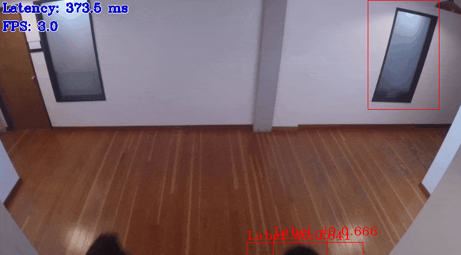
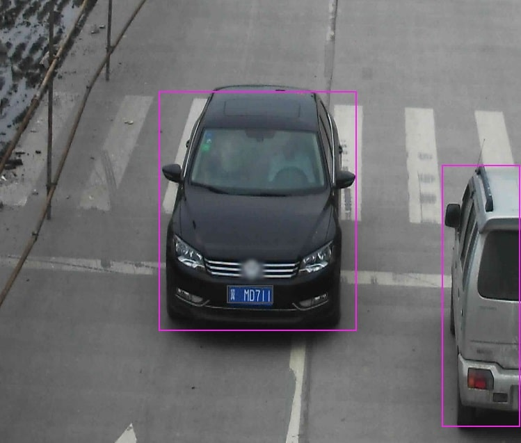

# [OpenVINO™ Toolkit](https://01.org/openvinotoolkit) - ARM CPU plugin

OpenVINO™ ARM CPU plugin is developed in order to enable deep neural networks inference on ARM CPUs, using OpenVINO™ API. The plugin uses [ARM Compute Library\*] as a backend.

## Supported Platforms
OpenVINO™ ARM CPU plugin is supported and validated on the following platforms: 

Host  | OS
------------- | -------------
Raspberry Pi* 4 Model B   | Debian* 10.3 (32-bit)
Raspberry Pi* 4 Model B   | Ubuntu* 18.04 (64-bit)

## Distribution
OpenVINO™ ARM CPU plugin is not included into Intel® Distribution of OpenVINO™. To use the plugin, it should be built from source code.

## How to build
### Approach #1: build OpenCV, OpenVINO™ and the plugin using pre-configured Dockerfile (cross-compiling, the preferred way)
OpenVINO™ and ARM CPU plugin could be built in Docker* container for [32-bit](Dockerfile.RPi32) Debian* and [64-bit](Dockerfile.RPi64) Ubuntu*:

1. Clone `openvino_contrib` repository:
```
git clone --recurse-submodules --single-branch --branch=master https://github.com/openvinotoolkit/openvino_contrib.git 
```
2.  Go to plugin directory:
 ```
cd openvino_contrib/modules/arm_plugin
```
3. Build a Docker* image:
```
docker image build -t arm-plugin -f Dockerfile.RPi32 .
```
4. Build the plugin in Docker* container:

Build process is performed by `/armplg_build.sh` script executed inside `/armcpu_plugin` directory (default container command to execute).
All intermediate results and build artifacts are stored inside working directory.

So one could either mount the whole working directory to get all results stored outside of the container:
```
mkdir build
docker container run --rm -ti -v $PWD/build:/armcpu_plugin arm-plugin
```
or export only the archive with artifacts:
```
docker container run --rm -ti --tmpfs /armcpu_plugin:rw -v $PWD:/remote \
                     arm-plugin sh -c "/armplg_build.sh && cp ./OV_ARM_package.tar.gz /remote"
```
> **NOTE**: There are a few environment variables that control `/armplg_build.sh` script execution.
>
> * *BUILD_JOBS* controls number of threads for simultaneous compilation
> * *BUILD_TYPE* controls Debug/Release configuration (Release by default)
> * *UPDATE_SOURCES* controls sources retrievement
>   - *clean*  - don't reload sources if already loaded, just clean build folders (default)
>   - *reload* - delete all loaded sources and retrieve them again
>   - *check*  - don't reload or cleanup sources
> * *WITH_OMZ* builds C++ Open Model Zoo demos (ON by default)
6. Extract the archive to target ARM platform

### Approach #2: build OpenVINO™ and the plugin without OpenCV using Docker* (cross-compiling)

1. Clone `openvino` and `openvino_contrib` repositories:
```
git clone --recurse-submodules --single-branch --branch=master https://github.com/openvinotoolkit/openvino.git 
git clone --recurse-submodules --single-branch --branch=master https://github.com/openvinotoolkit/openvino_contrib.git 
```
2. Build `ie_cross_armhf` image by performing the 3rd and the 4th steps of [the guideline].
3. Run Docker* container with mounted both `openvino` and `openvino_contrib` repositories:
```
docker container run --rm -it -v /absolute/path/to/openvino:/openvino \
                     -v /absolute/path/to/openvino_contrib:/openvino_contrib ie_cross_armhf /bin/bash 
```
The next commands of the procedure need to be run in `ie_cross_armhf` container.  
4. Install scons in the container:
```
apt-get install scons
```
5. Go to `openvino` directory:
```
cd openvino
```
6. Prepare a build folder:
```
mkdir build && cd build
```
7. Build OpenVINO™ with ARM plugin:
```
 cmake -DCMAKE_BUILD_TYPE=Release \
       -DCMAKE_TOOLCHAIN_FILE="../cmake/arm.toolchain.cmake" \
       -DTHREADING=SEQ \
       -DIE_EXTRA_MODULES=/openvino_contrib/modules \
       -DBUILD_java_api=OFF .. && make
```

As soon as `make` command is finished you can find the resulting OpenVINO™ binaries in the `openvino/bin/armv7l/Release` and the plugin `libarmPlugin.so` in `openvino/bin/armv7l/Release/lib`.

### Approach #3: build OpenVINO™ and the plugin without OpenCV on ARM platform (native compiling)
In order to build the plugin, you must prebuild OpenVINO™ package from source using [this guideline](https://github.com/openvinotoolkit/openvino/wiki/BuildingCode#building-for-different-oses).

Afterwards plugin build procedure is as following:

1.  Install necessary build dependencies:
```
sudo apt-get update  
sudo apt-get install -y git cmake  scons build-essential
```
2. Clone `openvino_contrib` repository:
```
git clone --recurse-submodules --single-branch --branch=master https://github.com/openvinotoolkit/openvino_contrib.git 
```
3.  Go to plugin directory:
 ```
cd openvino_contrib/modules/arm_plugin
```
4.  Prepare a build folder:
```
mkdir build && cd build
```
5.  Build plugin:
```
cmake -DInferenceEngineDeveloperPackage_DIR=<path to OpenVINO package build folder> -DCMAKE_BUILD_TYPE=Release .. && make
```

## Demos and Samples
### Open Model Zoo demos
By default Open Model Zoo demos are built alongside with the plugin. You can find C++ demos in `deployment_tools/inference_engine/demos/build` directory. 
Smoke testing has been done against the following OMZ demos:
* [Classification C++ Demo](https://github.com/openvinotoolkit/open_model_zoo/blob/master/demos/classification_demo)
* [Object Detection C++ Demo](https://github.com/openvinotoolkit/open_model_zoo/tree/master/demos/object_detection_demo)
* [Human Pose Estimation C++ Demo](https://github.com/openvinotoolkit/open_model_zoo/tree/master/demos/human_pose_estimation_demo)
* [Image Segmentation C++ Demo](https://github.com/openvinotoolkit/open_model_zoo/tree/master/demos/segmentation_demo)
* [Pedestrian Tracker C++ Demo](https://github.com/openvinotoolkit/open_model_zoo/tree/master/demos/pedestrian_tracker_demo)
* [Security Barrier Camera C++ Demo](https://github.com/openvinotoolkit/open_model_zoo/tree/master/demos/security_barrier_camera_demo)
* [Crossroad Camera C++ Demo](https://github.com/openvinotoolkit/open_model_zoo/tree/master/demos/crossroad_camera_demo)
* [Interactive Face Detection C++ Demo](https://github.com/openvinotoolkit/open_model_zoo/tree/master/demos/interactive_face_detection_demo)

Let's try to run object detection demo.
#### Model preparation
To speed up the process you may prepare the model on non-ARM platform.

1. Install [model downloader] from Open Model Zoo:
```
git clone https://github.com/openvinotoolkit/open_model_zoo.git
cd open_model_zoo/tools/downloader
python3 -mpip install --user -r ./requirements.in
```
2. Download model `yolo_v3_tiny` using model downloader:
```
python3 ./downloader.py --name yolo_v3_tiny --precisions FP32
```
#### Samples preparation
1. Clone video samples repository:
```
git clone https://github.com/intel-iot-devkit/sample-videos.git
```
#### Model inference on ARM
1. Copy OpenVINO™ and ARM plugin artefacts to ARM platform. If you build the plugin using approach #1, all artefacts are packed into `OV_ARM_package.tar.gz`.
2. Go to `deployment_tools/inference_engine/demos/build/<platform_type>/Release` directory:
```
cd <package_dir>/deployment_tools/inference_engine/demos/build/<platform_type>/Release
``` 
3. Add OpenCV and OpenVINO library directories to `LD_LIBRARY_PATH`:
```
export LD_LIBRARY_PATH=$LD_LIBRARY_PATH:<package_dir>/opencv/lib/:<package_dir>/deployment_tools/inference_engine/lib/<platform_type>/
```
4. Run object detection C++ demo:
```
./object_detection_demo -i <sample_videos_dir>/sample-videos/people-detection.mp4 \
                        -at yolo -m <model_dir>/yolo_v3_tiny/tf/FP32/yolo_v3_tiny.xml -d ARM
```
On the output video you should see people enclosed in red rectangles:



### OpenVINO™ samples
You could verify the plugin by running [OpenVINO™ samples]. You can find C++ samples in `deployment_tools/inference_engine/bin` directory (if you build the plugin using approach #1) or `openvino/bin/armv7l/Release` directory (if you build the plugin using approach #2 or #3). The following procedure assumes the approach #1 is used.  
OpenVINO™ samples require OpenCV libraries. If you build the plugin using approach #1 all needed OpenCV libraries are already placed in `build\lib` directory. If you build the plugin using approach #2 or #3 you need to install OpenCV or [build it from source].  
Let's try to run [Object Detection for SSD sample].  
#### Model preparation
1. Download model `vehicle-license-plate-detection-barrier-0123` using Model Preparation precedure described in Open Model Zoo demos section. 
2. Install [Model Optimizer]:
```
git clone https://github.com/openvinotoolkit/openvino.git
cd openvino/model-optimizer
pip3 install requirements.txt
cd ../..
```
3. Convert the model using model converter:
```
python3 ./converter.py --mo ../../../openvino/model-optimizer/mo.py \
                       --name vehicle-license-plate-detection-barrier-0123 --precisions FP32
```
#### Model inference on ARM
1. Copy OpenVINO™ and ARM plugin artefacts to ARM platform. If you build the plugin using approach #1, all artefacts are packed into `OV_ARM_package.tar.gz`.
2. Go to `deployment_tools/inference_engine/bin` directory:
```
cd deployment_tools/inference_engine/bin
```
3. Download a vehicle image, for instance, [this image]:
```
wget https://raw.githubusercontent.com/openvinotoolkit/openvino/master/scripts/demo/car_1.bmp
```
4. Copy model [Intermediate Representation] (`vehicle-license-plate-detection-barrier-0123.bin` and `vehicle-license-plate-detection-barrier-0123.xml` files generated by model converter) to ARM platform.

5. Run object detection sample on ARM platform:
```
export LD_LIBRARY_PATH=$LD_LIBRARY_PATH:$PWD/lib
./object_detection_sample_ssd -m vehicle-license-plate-detection-barrier-0123.xml -i car_1.bmp -d ARM
```

On the output image you should see 2 cars enclosed in purple rectangles and a front plate enclosed in grey rectangle:



One could try the plugin suitability and performance using not only OpenVINO™ samples but also Open Model Zoo demo applications and corresponding models. Demo applications could be built in accordance with [this guideline].

The plugin utilizes standard OpenVINO™ plugin infrastructure so could be tried with any demo based on supported DL model. In order to run the chosen demo with the plugin one should use "–d ARM" command-line parameter.

## Supported Configuration Parameters
The plugin supports the configuration parameters listed below. All parameters must be set before calling `InferenceEngine::Core::LoadNetwork()` in order to take effect. When specifying key values as raw strings (that is, when using Python API), omit the `KEY_` prefix.

Parameter name  | Parameter values  | Default  | Description
------------- | ------------- | ------------- | -------------
`KEY_CPU_THROUGHPUT_STREAMS`   | `KEY_CPU_THROUGHPUT_NUMA`, `KEY_CPU_THROUGHPUT_AUTO`, or non negative integer values  | 1  | Specifies number of CPU "execution" streams for the throughput mode. Upper bound for the number of inference requests that can be executed simultaneously. All available CPU cores are evenly distributed between the streams.
`KEY_CPU_BIND_THREAD`   | YES/NUMA/NO  | YES  | Binds inference threads to CPU cores. Enabled only if OpenVINO™ is built with TBB that supports affinity configuration
`KEY_CPU_THREADS_NUM` | positiv integer values| Limit `#threads` that are used by Inference Engine for inference on the CPU

## Supported Layers and Limitations
The plugin supports IRv10 and higher. The list of supported layers and its limitations are defined in [arm_opset.md](docs/arm_opset.md).

## Supported Model Formats
* FP32 – Supported and preferred
* FP16 – Supported
* I8 – Not supported

## Supported Input Precision
* FP32 - Supported
* FP16 - Supported
* U8 - Supported
* U16 - Supported
* I8 - Not supported
* I16 - Not supported

## Supported Output Precision 
* FP32 – Supported
* FP16 - Supported

## Supported Input Layout
* NCDHW – Not supported
* NCHW - Supported
* NHWC - Supported
* NC - Supported

## License
OpenVINO™ ARM CPU plugin is licensed under [Apache License Version 2.0](LICENSE).
By contributing to the project, you agree to the license and copyright terms therein
and release your contribution under these terms.

## How to Contribute
We welcome community contributions to `openvino_contrib` repository. 
If you have an idea how to improve the modules, please share it with us. 
All guidelines for contributing to the repository can be found [here](../../CONTRIBUTING.md).

---
\* Other names and brands may be claimed as the property of others.

[ARM Compute Library\*]:https://github.com/ARM-software/ComputeLibrary
[extra modules flags]:https://github.com/openvinotoolkit/openvino_contrib#how-to-build-openvino-with-extra-modules
[OpenVINO™ samples]:https://docs.openvinotoolkit.org/latest/openvino_docs_IE_DG_Samples_Overview.html
[build it from source]:https://docs.opencv.org/master/d7/d9f/tutorial_linux_install.html
[Object Detection for SSD sample]:https://docs.openvinotoolkit.org/latest/openvino_inference_engine_samples_object_detection_sample_ssd_README.html
[Model Optimizer]:https://github.com/openvinotoolkit/openvino/tree/master/model-optimizer
[model downloader]:https://github.com/openvinotoolkit/open_model_zoo/blob/master/tools/downloader/README.md#model-downloader-usage
[model converter]:https://github.com/openvinotoolkit/open_model_zoo/blob/master/tools/downloader/README.md#model-converter-usage
[this image]:https://github.com/openvinotoolkit/openvino/blob/master/scripts/demo/car_1.bmp
[Intermediate Representation]:https://docs.openvinotoolkit.org/latest/openvino_docs_MO_DG_IR_and_opsets.html#intermediate_representation_used_in_openvino
[the guideline]:https://github.com/openvinotoolkit/openvino/wiki/BuildingForRaspbianStretchOS#cross-compilation-using-docker
[this guideline]:https://github.com/openvinotoolkit/open_model_zoo/blob/master/demos/README.md#build-the-demo-applications
