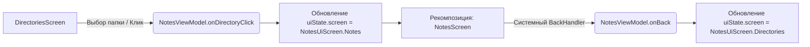

# Архитектура UI-слоя (Presentation Layer)

Презентационный слой приложения разработан на базе **Jetpack Compose** и реализует реактивный подход к отображению данных. Управление состоянием разделено на два подхода в зависимости от специфики экрана: использование классического `StateFlow` (для авторизации и онбординга) и прямое использование `mutableStateOf` во ViewModel для минимизации оверхеда при частых обновлениях (списки заметок, редактор).

---

## 1. Компоненты UI-слоя

Вся бизнес-логика презентации инкапсулирована во ViewModels, которые внедряются в UI-компоненты с помощью DI-фреймворка **Koin**.

| ViewModel | Тип состояния | Стратегия навигации | Архитектурная роль |
| :--- | :--- | :--- | :--- |
| `AuthViewModel` | `StateFlow<AuthUiState>` | Шаги внутри экрана (`AuthScreenStep`) | Управление сессией пользователя (Firebase Auth / Google Sign-In), валидация и обработка ошибок входа. |
| `OnboardingViewModel` | `MutableStateFlow` / `StateFlow` | Пошаговый интерактивный тур | Подсчет координат целевых элементов (`Rect`), управление подсказками и сохранение флага завершения в `Preferences`. |
| `NotesViewModel` | `mutableStateOf(NotesUiState)` | Стейт-ориентированная (`NotesUiScreen`) | Главный координатор списков: папки, заметки, поиск, избранное. Управляет навигацией через изменение поля `screen`. |
| `EditorViewModel` | Раздельные `mutableStateOf` поля | Назад (BackHandler) | Облегченная модель для изоляции состояния конкретной редактируемой заметки (динамический ввод текста, вложения). |

---

## 2. Схемы управления состоянием и навигации

### Стейт-ориентированная навигация в списках (`NotesViewModel`)

В отличие от классического Jetpack Compose Navigation, переключение между экраном папок (`Directories`) и экраном заметок конкретной папки (`Notes`) происходит декларативно через изменение свойства `uiState.screen` типа `NotesUiScreen`. Это позволяет сохранять контекст данных без сложной передачи аргументов по строковым путям.



###Архитектура потока данных в редакторе (EditorViewModel)
Для предотвращения лишних рекомпозиций всего экрана при каждом нажатии клавиши (вводе символа в BasicTextField), EditorViewModel не использует единый объект Data Class для всего стейта. Вместо этого ключевые свойства разнесены по атомарным наблюдаемым полям:

```kotlin
graph TD
    UI[EditorScreen: BasicTextField] -- onValueChange --> VM_Change(EditorViewModel.onContentChange)
    VM_Change --> VM_State[var content: String by mutableStateOf]
    VM_State --> UI_Recompose[Быстрая рекомпозиция только текстового поля]

    UI_Save[Кнопка Назад / Автосохранение] --> VM_Build(EditorViewModel.buildUpdatedNote)
    VM_Build --> Domain[NotesUseCases.updateNoteUseCase]
```

##3. Спецификация экранов и UI-компонентов
####Экраны списков (DirectoriesScreen & NotesScreen)
Особенности реализации: Активно используют LazyColumn со строго типизированными элементами интерфейса (DirectoryItemUi, NoteItemUi).

####Поиск:
Поисковый запрос обрабатывается реактивно через SearchNotesUseCase. Поле ввода интегрировано с модулем онбординга через кастомный модификатор .onboardingTarget().

####Контекстные действия:
 Длинный тап на папку или заметку активирует режим выбора/удаления, минуя открытие карточки.

####Экран редактора (EditorScreen)
#####Компонент ввода:
 Построен на базе BasicTextField с кастомной декорацией (editorPlainTextFieldDecoration), что обеспечивает плавный скролл и адаптацию под экранную клавиатуру.

#####Медиавложения:
 Поддерживает динамическое добавление элементов ContentItem (изображения, файлы, ссылки). Список вложений фильтруется с помощью расширения .withoutTextItems(), отделяя бинарный контент от тела заметки.

#####Перехват системных кнопок:
На экранах авторизации и редактирования явно объявлен BackHandler, предотвращающий случайное закрытие приложения или потерю несохраненного текста.

##4. Внедрение зависимостей (DI) в AppModule.kt
Регистрация ViewModels и связывание их с доменным слоем (Use Cases) вынесены в модуль Koin. ViewModels списков и онбординга регистрируются через viewModelOf для автоматического разрешения конструкторов, а AuthViewModel настраивается вручную для явной передачи контекста приложения:
```kotlin
val appModule = module {
    // Фабрики Use Cases
    factory { NotesUseCases(...) }

    // Презентационный слой
    viewModelOf(::NotesViewModel)
    viewModelOf(::OnboardingViewModel)
    viewModel {
        AuthViewModel(
            firebaseAuth = get(),
            app = androidApplication(),
            appSessionPreferences = get(),
            clearLocalDataOnSignOut = get()
        )
    }
}
```