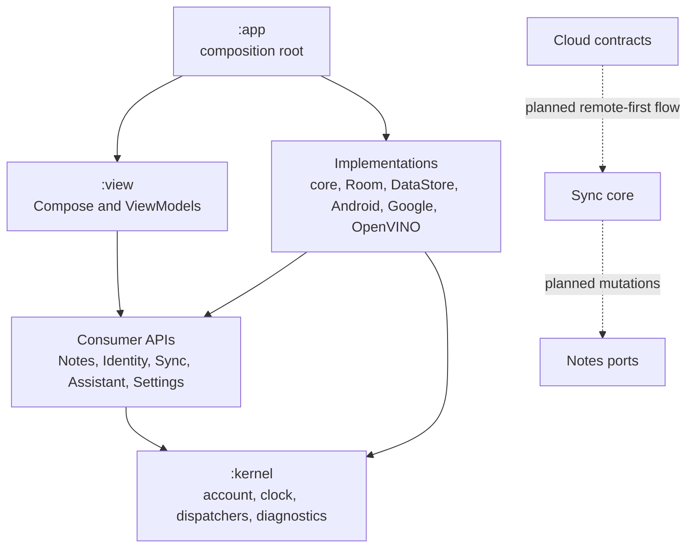

<!--
Copyright (C) 2018-2026 Intel Corporation
SPDX-License-Identifier: Apache-2.0
-->

# System Overview

## Purpose and Scope

OpenVINO Notes is an Android notes application foundation with structured text
and media, folders, local persistence, account isolation, future Drive sync, and
future on-device OpenVINO assistance. The architecture is designed so the Notes
domain, synchronization engine, model adapters, Android UI, and vendor identity
integration can evolve without importing one another's implementation details.

The repository currently delivers the complete module graph, domain contracts,
Room adapters, Compose presentation boundaries, account-scoped WorkManager
scheduling, placeholder external adapters, and architecture tests. It does not
bundle Google credentials, a Drive HTTP implementation, OpenVINO Android native
libraries or models, production synchronization, release signing, or validated
device inference.

## Architectural Shape

Dependencies point toward stable contracts. UI consumes product-facing services
and never storage ports. Implementations can depend on their own API and neutral
cross-capability contracts, but not on sibling implementations. `:app` chooses
implementations and owns their lifecycle.

In this handbook, a **port** is a provider-neutral interface at an architectural
boundary. Core modules depend on ports, while adapters implement them with Room,
WorkManager, Drive, or other infrastructure. This keeps policy independent of
Android and vendor APIs and allows tests to substitute in-memory implementations.

## Core Principles

1. **Account scope is explicit.** `AccountKey` partitions every note, file,
   checkpoint, remote request, and scheduled job. Background work never reads the
   account currently visible in the UI.
2. **Contracts precede adapters.** Consumer services expose useful application
   behavior; `api.port` packages expose infrastructure seams only to core and
   adapter modules.
3. **Offline state is authoritative locally.** Notes and durable sync metadata are
   transactional. A later sync engine must reconcile revisions without creating
   an outbox loop.
4. **Large binary data stays streamed.** Attachments are stored as app-private
   local files. Public Notes and View contracts carry metadata, not absolute paths
   or unbounded byte arrays; storage and Drive sync access bytes through bounded
   reads. Full in-memory materialization is allowed only behind an explicit size
   limit. Cloud-only attachments without a local source are outside the current
   local-first model.
5. **Unavailable integrations fail honestly.** Placeholders return typed
   `NotConfigured` or unavailable outcomes and never imitate a successful remote
   or inference operation.
6. **Ownership follows lifetime.** Application resources are created and closed
   by `AppComposition`; activity-bound launchers remain in `MainActivity`.
7. **Architecture is executable.** Module inventory, dependency ceilings,
   namespace rules, platform neutrality, View isolation, and DI ownership are
   checked by Gradle.

## Primary Runtime Flows

- **Local edit:** View action → `NotesService` → domain validation → Room
  transaction → Note/folder tables plus local outbox record → observed UI state.
- **Assistant suggestion:** View action → `AssistantService` → Notes read and
  bounded attachment access → text/image AI API → typed suggestion → explicit
  user application through Notes.
- **Sign-in:** View emits a one-shot effect → `MainActivity` invokes an
  activity-scoped identity controller → typed result returns to the ViewModel →
  session state updates the neutral account scope.
- **Scheduled sync:** scheduler embeds an immutable account key → Worker restores
  that key from input → executor invokes the account-scoped sync service. The
  shipped service stops with `Blocked(NotConfigured)` before mutation.

Detailed invariants and ownership rules are defined in the remaining chapters.
