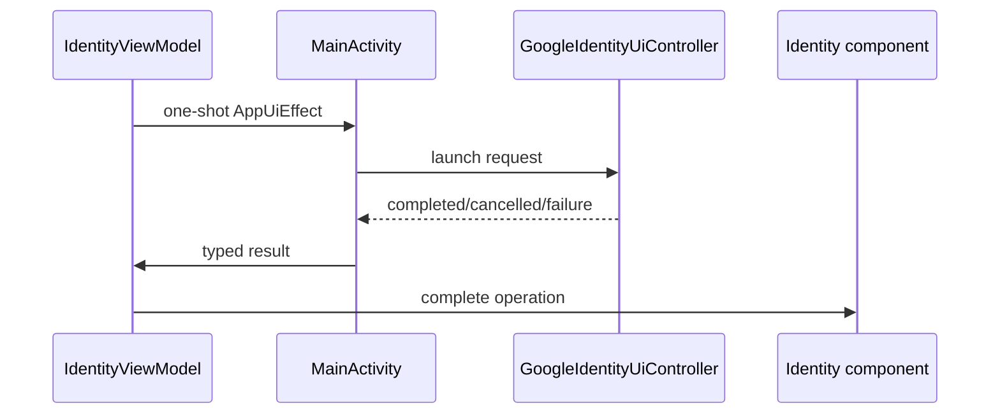

<!--
Copyright (C) 2018-2026 Intel Corporation
SPDX-License-Identifier: Apache-2.0
-->

# Identity and Security

## Neutral Account Partition

`AccountKey` and `AccountScope` belong to `:kernel`, not Identity. `AccountKey`
validates the opaque stable value used to partition Notes, attachments, cloud
objects, checkpoints, and background work. `AccountScope` exposes the current key
to neutral application policy without forcing `:notes:core` or `:sync:core` to
depend on a sign-in vendor or UI session model.

Account keys are identifiers, not authorization tokens. They may be persisted in
local database keys and WorkManager input; bearer tokens and transfer session
capabilities may not.

## Authentication and Drive Authorization

Identity exposes two independent state machines:

- `AuthenticationState` starts as `Initializing`, then becomes `SignedOut` or
  `SignedIn`. Startup does not guess a signed-out state before restoration ends.
- `DriveAuthorizationState` records whether the signed-in account granted the
  separate Drive capability. Signing in does not imply Drive access.

Consumer APIs expose session state and sign-in/sign-out behavior. Credential
retrieval is an infrastructure port under `identity.api.port`, keeping bearer
tokens out of View state and consumer models.

## Activity-Bound User Interaction

Google sign-in and authorization require an Android activity result launcher.
The application-scoped identity component therefore never retains an `Activity`
or launcher. The runtime flow is:

The controller is created for the Activity lifetime and released with it. Typed
results distinguish completion, user cancellation, missing configuration, and
provider failure; no cancelled flow is presented as success.

## Token and Capability Handling

`AccessTokenProvider` returns a typed token outcome only to infrastructure
adapters. It also exposes explicit invalidation so a Drive adapter can discard a
cached credential after HTTP 401 before retrying through policy. Tokens must not
be logged, placed in Compose state, stored in WorkManager input, or used as an
account key.

Resumable upload session IDs are opaque remote capabilities. Sync may persist
them only through `SyncTransferCheckpointPort`. Their string representation is
redacted, and diagnostics should log the stable operation/object identifiers and
offset—not the session value. The same rule applies to future authorization
codes, refresh tokens, model-license tokens, and signed download URLs.

## Configuration Boundary

The shipped Google adapter is an honest placeholder: credentials and provider
SDK wiring are absent, so it reports `NotConfigured`. Adding real integration
requires configuration outside source-controlled secrets, typed error mapping,
token invalidation tests, Activity recreation tests, and proof that application
objects do not retain Activity instances. Firebase and the Google Services Gradle
plugin remain forbidden by the architecture gate unless the design is explicitly
revisited.
