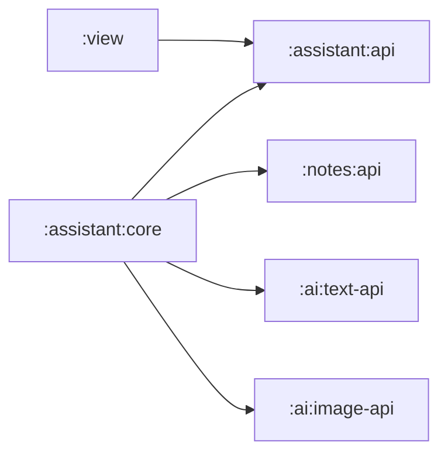

<!--
Copyright (C) 2018-2026 Intel Corporation
SPDX-License-Identifier: Apache-2.0
-->

# AI and Assistant

## Independent Inference Capabilities

Text and image inference are separate capabilities so either model stack can be
replaced, omitted, tested, or initialized independently:

- `:ai:text-api` exposes typed summary, tag suggestion, and rewrite operations.
- `:ai:text-openvino` owns text prompt construction, output normalization,
  bounded retry policy, cancellation propagation, and diagnostic mapping.
- `:ai:image-api` exposes structured image tags with confidence values.
- `:ai:image-openvino` owns image preprocessing and model execution policy.

These APIs do not depend on Notes, Compose, Room, or each other. They accept
inference inputs and return typed outcomes; they do not mutate a Note. Current
OpenVINO adapters are placeholders because native libraries, model/tokenizer
assets, device selection, and packaging are not included.

## Assistant Orchestration

`:assistant:api` presents note-level actions to View. `:assistant:core` coordinates
Notes and the two inference APIs:

The core loads a Note through Notes contracts, derives the minimal inference
input, and returns a structured suggestion. Applying a suggestion is a separate
operation: summary updates only `summary`, tags are normalized and deduplicated,
and a rewrite updates only the targeted `Text` content item. The core does not
rebuild the full aggregate or silently apply model output.

## Binary and Memory Limits

Assistant code resolves attachment metadata through Notes ports. Public Assistant
and View APIs never carry attachment file paths or arbitrary `ByteArray` fields.
Image inference currently needs a contiguous value, so the core uses the explicit
bounded `BinarySource.readAll` helper with a 64 MiB maximum. Oversized, truncated,
or cancelled reads return failure rather than allocating without a limit.

Future model adapters should prefer streaming or tiled preprocessing when their
runtime supports it. Any higher contiguous limit requires device-memory evidence
and tests; it must not be increased merely to accept one sample.

## Adapter Lifecycle and Failure Semantics

Model adapters are application-scoped `AutoCloseable` resources owned by
`AppComposition`. Initialization should be lazy or bounded, publish a typed
readiness state, and close native/model resources exactly once. Cancellation must
propagate through inference and must not be converted to a retryable model error.

Adapters distinguish at least not configured, invalid input, model/runtime
failure, resource exhaustion, and cancellation. Logs may include operation IDs,
model identity, duration, and device class, but not Note text, attachment bytes,
prompts containing user content, or secrets.

## Adding a Production OpenVINO Adapter

A production change must keep vendor imports inside the matching `*-openvino`
module, package native libraries for each selected ABI, document model provenance
and preprocessing, verify output normalization, and add deterministic adapter
tests. Validate initialization, cancellation, repeated calls, shutdown, low-memory
behavior, and real arm64 device execution before changing a placeholder to an
available state.
