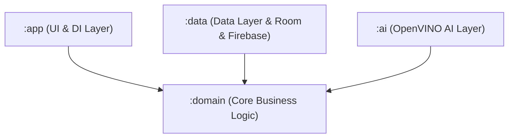

# Архитектура и технологический стек

Проект строго следует принципам **Clean Architecture** (Чистой архитектуры) и разделен на изолированные модули. Это обеспечивает независимость бизнес-логики от изменений в UI-слое, базах данных или сторонних ИИ-библиотеках.

 

### 🏗 Структура модулей

Здесь представлена схема зависимостей модулей проекта. Каждый модуль выполняет строго определенную роль в архитектуре.

###📝 Описание роли модулей
:domain — Слой является центральным и наиболее стабильным слоем приложения. Он содержит бизнес-логику, не зависящую от деталей реализации пользовательского интерфейса, источников данных и внешних фреймворков. Слой спроектирован в соответствии с принципами чистой архитектуры: все зависимости направлены внутрь, а доменные сущности и сценарии использования не имеют ссылок на внешние слои.

:app — Слой UI. Отвечает за представление (Jetpack Compose / MVVM) и внедрение зависимостей (Dependency Injection). Получает данные через domain-слой и отображает их пользователю.

:data — Слой данных. Реализует интерфейсы репозиториев, определенных в модуле domain. Отвечает за работу с локальной БД Room и синхронизацию с Firebase Storage.

:ai — Слой является слоем инфраструктуры, отвечающим за интеграцию с нейросетевыми моделями. Он содержит конкретную реализацию интерфейса NoteAiService, определённого в Domain-слое, и обеспечивает выполнение моделей искусственного интеллекта на устройстве с использованием библиотеки OpenVINO. Слой инкапсулирует всю специфику работы с нейросетевым движком: загрузку моделей, предобработку данных, инференс и постобработку результатов.

###🛠 Детальный технологический стек
Спецификация используемых технологий и библиотек, разделенная по уровням абстракции:

####1. Платформа и Язык
Язык разработки: Kotlin (строгая типизация, Null-Safety, расширения).

Минимальная версия Android SDK: API 26+ (для обеспечения совместимости с современными ИИ-библиотеками).

Целевая версия Android SDK: API 37.

####2. Инференс ИИ на устройстве (On-Device AI)
Среда исполнения: OpenVINO™ Toolkit (Java API фреймворка, оптимизированный под мобильные процессоры).

Нейросетевые модели: Семейство моделей YOLO (YOLOv10 / YOLOv26).

Адаптивная оптимизация: Архитектура приложения поддерживает динамическое переключение моделей ИИ в зависимости от аппаратных возможностей устройства. Для современных смартфонов с мощными NPU/GPU загружаются старшие версии моделей, а для более старых устройств — легковесные квантованные версии, что гарантирует стабильный FPS и экономию заряда батареи.

####3. Асинхронность и Реактивность
Управление потоками: Kotlin Coroutines (использование suspend функций, концепции структурной асинхронности, явные вызовы await() для обработки отложенных результатов вычислений нейросетей).

Реактивные потоки: Kotlin Flows (StateFlow / SharedFlow). UI-слой реактивно подписывается на изменения состояний, что исключает утечки памяти и гарантирует корректное обновление интерфейса при фоновой обработке данных (например, во время инференса или синхронизации).

####4. Локальное и Облачное хранение (Data Layer)
Локальная база данных: Room ORM (абстракция над SQLite с compile-time проверкой SQL-запросов). Используется для мгновенного доступа к заметкам в офлайн-режиме.

Удаленное облачное хранилище: Firebase Storage.

Архитектура синхронизации: Для каждого пользователя в облаке создается изолированная директория, разделенная на два логических блока:

/notes/*.json — структурированные текстовые данные заметок, сериализованные в легковесный формат JSON.

/media/* — связанные бинарные медиафайлы (изображения, аудиозаписи).
Такой подход обеспечивает высокую скорость синхронизации без необходимости поддержки сложных реляционных СУБД на бэкенде.

####5. Архитектурные инструменты
Внедрение зависимостей (DI): Koin — легковесный, нативный для Kotlin фреймворк Service Locator. Используется для управления временами жизни объектов (Scopes) и слабой связанности компонентов между модулями.