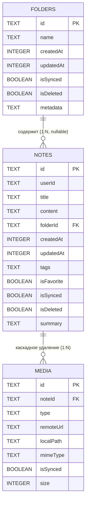

# Схема базы данных (Room Database)

Локальное хранилище спроектировано на базе библиотеки **Jetpack Room** (обертка над SQLite). База данных реализует концепцию **Offline-First**: любые изменения пользователя мгновенно пишутся в локальные таблицы, а специализированные флаги разметки сигнализируют фоновому воркеру о необходимости синхронизации с Firebase Storage.

---

## 1. ER-Диаграмма связей (Entity-Relationship)

Схема состоит из трех основных таблиц: папки (`folders`), заметки (`notes`) и бинарные медиавложения (`media`). Связи между ними построены на уровне ограничений внешних ключей (Foreign Keys) базы данных SQLite.

## 2. Спецификация таблиц и схемы данных

### Таблица `folders` (Папки заметок)

Хранит пользовательские каталоги для группировки заметок.

| Имя колонки | Тип данных SQLite | Ограничения | Описание |
| :--- | :--- | :--- | :--- |
| `id` | `TEXT` | `PRIMARY KEY` | Уникальный UUID папки, генерируемый на клиенте. |
| `name` | `TEXT` | `NOT NULL` | Название папки. |
| `createdAt` | `INTEGER` | `NOT NULL` | Таймстамп создания (конвертируется из `Instant`). |
| `updatedAt` | `INTEGER` | `NOT NULL` | Таймстамп последнего изменения структуры или имени. |
| `isSynced` | `INTEGER` | `DEFAULT 0` | Флаг успешной отправки состояния папки в облако. |
| `isDeleted` | `INTEGER` | `DEFAULT 0` | Флаг "мягкого" удаления папки (Soft Delete). |
| `metadata` | `TEXT` | `NOT NULL` | JSON-строка дополнительных параметров папки (через `TypeConverter`). |

---

### Таблица `notes` (Заметки)

Центральная таблица модуля. Хранит текстовое содержимое заметок и их метаданные.

| Имя колонки | Тип данных SQLite | Ограничения | Описание |
| :--- | :--- | :--- | :--- |
| `id` | `TEXT` | `PRIMARY KEY` | Уникальный UUID заметки. |
| `userId` | `TEXT` | `NOT NULL` | Идентификатор владельца (Firebase UID) для изоляции данных. |
| `title` | `TEXT` | `NOT NULL` | Заголовок заметки. |
| `content` | `TEXT` | `NOT NULL` | Текстовое содержимое (плоская сериализованная строка контента). |
| `folderId` | `TEXT` | `NULLABLE` | Ссылка на `folders(id)`. При удалении папки выставляется в `SET NULL`. |
| `createdAt` | `INTEGER` | `NOT NULL` | Время создания. |
| `updatedAt` | `INTEGER` | `NOT NULL` | Время изменения (триггерит проверку конфликтов при синхронизации). |
| `tags` | `TEXT` | `NULLABLE` | Список тегов, закешированный в виде плоской строки. |
| `isFavorite` | `INTEGER` | `DEFAULT 0` | Метка "Избранное" (0 — false, 1 — true). |
| `isSynced` | `INTEGER` | `DEFAULT 0` | Статус синхронизации JSON-слепка с Firebase Storage. |
| `isDeleted` | `INTEGER` | `DEFAULT 0` | Метка мягкого удаления для отложенной очистки в облаке. |
| `summary` | `TEXT` | `NULLABLE` | Саммари текста, сгенерированное локальной моделью OpenVINO. |

---

### Таблица `media` (Бинарные вложения)

Хранит информацию о тяжелых ресурсах (картинки, файлы), прикрепленных к контенту заметки.

| Имя колонки | Тип данных SQLite | Ограничения | Описание |
| :--- | :--- | :--- | :--- |
| `id` | `TEXT` | `PRIMARY KEY` | Уникальный идентификатор ресурса. |
| `noteId` | `TEXT` | `NOT NULL`, `FOREIGN KEY` | Ссылка на `notes(id)`. Ограничение `ON DELETE CASCADE`. |
| `type` | `TEXT` | `NOT NULL` | Тип вложения: `"IMAGE"` или `"FILE"`. |
| `remoteUrl` | `TEXT` | `NULLABLE` | Относительный путь к объекту в бакете Firebase Storage. |
| `localPath` | `TEXT` | `NULLABLE` | Абсолютный путь к закешированному файлу в приватной директории приложения. |
| `mimeType` | `TEXT` | `NOT NULL` | MIME-тип файла (например, `image/png`, `application/pdf`). |
| `isSynced` | `INTEGER` | `DEFAULT 0` | Статус выгрузки бинарного файла в облако. |
| `size` | `INTEGER` | `NULLABLE` | Размер файла в байтах. |

##3. Целостность данных и оптимизация (Индексы и Внешние ключи)
Для обеспечения высокой скорости выборки и защиты от «сиротских» (orphan) записей на уровне SQLite настроены следующие конфигурации:

Каскадное удаление ресурсов: Таблица media связана с таблицей notes через ForeignKey(onDelete = ForeignKey.CASCADE). Если пользователь окончательно стирает заметку из базы, операционная система автоматически уничтожает все связанные с ней метаданные вложений из таблицы media.

Индексация внешних ключей: Поле noteId в таблице media принудительно промаркировано аннотацией @Index. Это исключает полное сканирование таблицы (Full Table Scan) при открытии конкретной заметки и извлечении её медиа-компонентов.

##4. Механизм Offline-First разметки (isSynced и isDeleted)
Синхронизация опирается на комбинацию двух флагов, которые меняются атомарно внутри локальных транзакций:

Модификация локально: При любом сохранении или изменении заметки/папки код сбрасывает isSynced = false и обновляет updatedAt = Clock.System.now(). Это сигнал для SyncWorker, что локальный слепок стал новее облачного.

Мягкое удаление (Soft Delete): Когда пользователь нажимает "Удалить паку/заметку", приложение выполняет isDeleted = true и isSynced = false. Объект пропадает из UI, но физически остается в БД. SyncManager видит эту комбинацию, отправляет в Firebase запрос на удаление файла, и только после успешного ответа сервера выполняет финальный SQL-запрос DELETE для полной очистки таблицы.