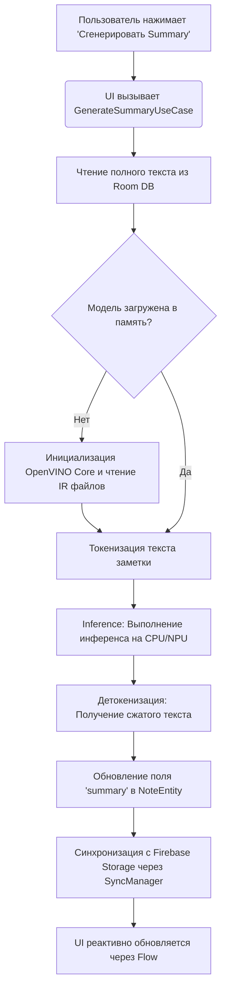

# Локальный ИИ и Интеграция OpenVINO

Главная особенность приложения — возможность локальной генерации краткого содержания (саммари) для заметок. Чтобы обеспечить максимальную приватность пользователя и независимость от интернет-соединения, обработка текста происходит непосредственно на устройстве с использованием инструментария **Intel OpenVINO™**.

Конвейер машинного обучения интегрирован в существующую Clean Architecture и работает асинхронно, не блокируя UI-поток.

---

## 1. Архитектурные компоненты ИИ-слоя

Взаимодействие с нейросетью вынесено в отдельный инфраструктурный слой, который общается с бизнес-логикой через абстракции (интерфейсы).

| Компонент | Уровень архитектуры | Зона ответственности |
| :--- | :--- | :--- |
| `OpenVinoEngine` | **Infrastructure / Data** | Низкоуровневая обертка над C++ API / Java API OpenVINO. Отвечает за загрузку скомпилированной модели (IR: `.xml` и `.bin` файлы) в память устройства. |
| `AiSummaryRepositoryImpl` | **Data Layer** | Реализует подготовку промптов, вызов токенизатора, передачу тензоров в `OpenVinoEngine` и декодирование результата. |
| `GenerateSummaryUseCase` | **Domain Layer** | Оркестратор бизнес-логики. Принимает ID заметки, достает ее текст, запрашивает генерацию у репозитория и сохраняет результат в поле `summary` (обновляя Room). |
| `SummaryWorker` | **WorkManager** | Опциональный фоновый планировщик. Может запускать генерацию саммари для больших заметок в фоне, пока устройство находится на зарядке. |

---

## 2. Жизненный цикл генерации саммари

Процесс обработки текста жестко регламентирован, чтобы избежать утечек памяти (Out Of Memory) на мобильных устройствах.

##3. Оптимизация и работа с памятью
Поскольку локальные LLM (Large Language Models) требовательны к ресурсам, в проекте применяются следующие подходы:

Квантование моделей: Используются модели, сжатые до INT8 или INT4 (например, форматы NNCF). Это снижает вес модели в хранилище и ускоряет инференс без существенной потери качества.

Асинхронное выполнение: Весь инференс выполняется на Dispatchers.Default (для CPU-интенсивных задач).

Освобождение ресурсов: После генерации сессии, если ИИ-движок не используется определенное время, OpenVinoEngine очищает память, выгружая тяжеловесные графы.

##4. Тестирование ИИ-компонентов
Для обеспечения стабильности доменного слоя без необходимости запускать ресурсоемкий ИИ-движок во время прогона CI/CD, применяется жесткое мокирование зависимостей с помощью MockK:

В Unit-тестах AiSummaryRepository полностью изолируется.

Проверяется корректность работы GenerateSummaryUseCase (правильно ли формируется промпт на основе contentItems и обновляется ли updatedAt после получения ответа от заглушки).

Для интеграционных проверок используются легковесные тестовые (dummy) модели, которые всегда возвращают статичную строку.