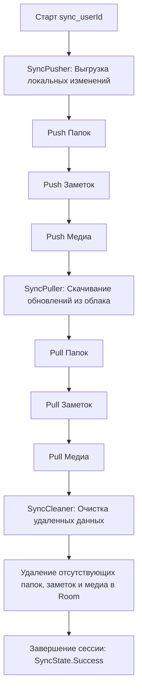

# Модуль синхронизации: Оркестрация SyncManager

Центральным компонентом синхронизации данных между локальным хранилищем (SQLite/Room) и удаленным облаком (Firebase Storage) является интерфейс `SyncManager` и его реализация `SyncManagerImpl`.

Система спроектирована по принципу **Offline-First**: пользователь имеет полный доступ к чтению и модификации данных без активного сетевого соединения. Слияние состояний происходит асинхронно при восстановлении сети.

Для соблюдения принципа единственной ответственности (SRP) сложная логика монолита разделена на три изолированные фазы: выгрузка (`SyncPusher`), загрузка (`SyncPuller`) и локальная очистка (`SyncCleaner`).

## 1. Алгоритм синхронизации (Трехфазный коммит)

Процесс запускается вызовом функции `sync(userId: String)` и состоит из последовательной обработки трех типов данных: Папки (Folders) ➔ Заметки (Notes) ➔ Бинарные медиа (Media).


### Детальные шаги выполнения:
Фаза Push (Выгрузка):
Через SyncPusher менеджер запрашивает все локальные записи (папки, заметки, медиа), имеющие флаг isSynced = false. Если локальная сущность помечена как удаленная (isDeleted = true), на сервер отправляется запрос на удаление соответствующего файла, после чего запись физически стирается из Room (hard delete). Остальные модифицированные записи формируются в JSON-пакеты (или потоки байтов для медиа) и отправляются в Firebase Storage. После успеха статус меняется на isSynced = true.

Фаза Pull (Скачивание):
SyncPuller запрашивает облачные слепки (списки метаданных) для папок, заметок и медиафайлов пользователя. Сравнивая ключи из облака с ID локальных записей, система определяет недостающие элементы. Эти элементы скачиваются, парсятся из JSON и сохраняются в локальную базу данных (через SyncDaoContainer).

Фаза Clean (Очистка):
SyncCleaner берет множества (Sets) ID элементов, полученных на этапе скачивания, и вычисляет разницу с локальной БД. Если локальная запись присутствует в Room, но отсутствует в облачном слепке, она считается удаленной с другого устройства и физически стирается локально (для медиа удаляются и сами файлы из памяти устройства).

## 2. Управление состояниями (SyncState)
Для реактивного отображения статуса синхронизации в UI (например, для показа спиннера загрузки) менеджер предоставляет StateFlow<SyncState>.
##### Возможные состояния:

SyncState.Idle — синхронизация не запущена.

SyncState.Syncing — активный процесс обмена данными (Push/Pull/Clean).

SyncState.Success — все три фазы успешно завершены.

SyncState.Error — процесс прерван с ошибкой (содержит сообщение об ошибке).

## 3. Полиморфная сериализация данных
Поскольку заметки (Note) и папки (Folder) имеют динамическую структуру, для их сохранения на сервере применяется сериализация на базе kotlinx.serialization. Преобразования изолированы в классе SyncMappers (NoteEntityJsonConverter и FolderEntityJsonConverter).

Каждая сущность упаковывается в текстовый JSON-файл.
### Пример структуры:
```json
{
  "id": "e8ba5411-137a-4c28-9642-e10bcbf14291",
  "userId": "firebase_user_uid_123",
  "title": "Лекция по OpenVINO",
  "folderId": "folder_architecture_01",
  "createdAt": "2026-05-18T10:00:00Z",
  "updatedAt": "2026-05-18T12:45:30Z",
  "isFavorite": true,
  "summary": "Краткое содержание лекции, сгенерированное локальной нейросетью...",
  "contentItems": [
    {
      "type": "com.itlab.domain.model.ContentItem.Text",
      "id": "txt_01",
      "text": "Вводная часть по оптимизации моделей."
    },
    {
      "type": "com.itlab.domain.model.ContentItem.Image",
      "id": "img_01",
      "source": {
        "remoteUrl": "users/firebase_user_uid_123/media/e8ba5411-137a-4c28-9642-e10bcbf14291_img_01",
        "localPath": "/data/user/0/com.itlab.notes/files/media/img_01"
      },
      "mimeType": "image/png"
    }
  ]
}
```

### Изоляция путей
При передаче медиафайлов в Firebase локальные абсолютные пути устройства (localPath) очищаются или игнорируются на других устройствах. Привязка идет по уникальному remoteUrl, строящемуся по маске users/$userId/media/${noteId}_${mediaId}. При входящем потоке (Download) скачанные данные сохраняются в context.filesDir/media/, и таблица Room обновляется актуальным локальным адресом.