# OpenVINO™ Model Server - AI Extension

This document describes on how to use the OpenVINO™ Model Server - AI Extension to run inference on Intel® CPU, iGPU and Intel® Movidius™ Myriad VPU. 

<a id="top"> </a>
## Table of Contents
* [About OpenVINO™ Model Server - AI Extension](#about)
* [Deploying OpenVINO™ Model Server - AI Extension](#deploy)
* [Configuration of OpenVINO™ Model Server - AI Extension](#configuration)
* [Running the OpenVINO™ Model Server - AI Extension on Linux machine](#run_on_linux)
* [Deploying the OpenVINO Model Server on Azure IoT Edge](#iotedge)
* [Running Inference on OpenVINO™ Model Server - AI Extension](#run_inference)
* [OpenVINO™ Model Server - AI Extension parameters](#parameters)
* [REST API](#rest_api)
* [Supported models categories](#supported_models)
* [Target device selection for models](#target_device)
* [Performance tuning](#preformance_tuning)
* [Models configuration](#model_config)
* [Running Tests](#running_tests)

<a id="about"> </a>
## About OpenVINO™ Model Server - AI Extension 

The OpenVINO™ Model Server - AI Extension contains [OpenVINO™ Model Server (OVMS)](https://docs.openvino.ai/latest/openvino_docs_ovms.html), powered by the [Intel® OpenVINO toolkit](https://docs.openvino.ai/latest/get_started.html) and an extension to enable exchange of video frames and inference results between [Azure Video Analyzer (AVA)](https://docs.microsoft.com/en-us/azure/azure-video-analyzer/video-analyzer-docs/overview) and OpenVINO™ Model Server (OVMS).

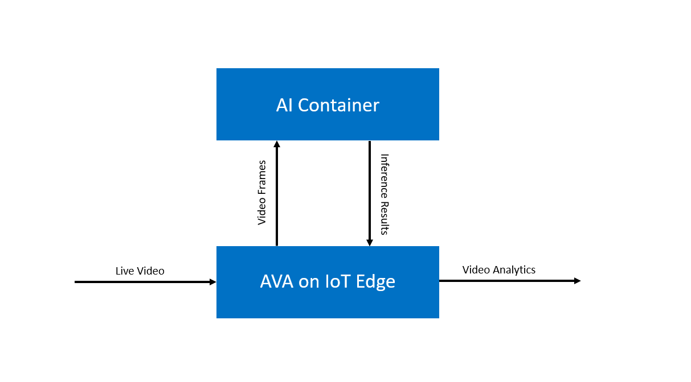

OpenVINO™ Model Server - AI Extension exposes an REST API that conforms to the HTTP extension [contract](https://docs.microsoft.com/en-us/azure/azure-video-analyzer/video-analyzer-docs/edge/http-extension-protocol) specified for AVA. This interface supports a range of model categories and returns JSON response including model metadata like attribute, labels or classes names. 

Beside the REST API, the server also exposes the complete OpenVINO™ Model Server REST and gRPC API, which could be used with an arbitrary OpenVINO™ model. 

<a id="deploy"> </a>
## Deploying OpenVINO™ Model Server - AI Extension  

This guide provides step-by-step instructions on how to deploy the OpenVINO™ Model Server - AI Extension for Linux and for Azure Video Analyzer.

> To know more about the confiurations of refer OpenVINO™ Model Server - AI Extension the section [Configuration of OpenVINO™ Model Server - AI Extension](#configuration)

### 1. System Requirements
1. Hardware :
  * Required
      * 6th to 11th generation Intel® Core™ processors and Intel® Xeon® processors.

  * Optional:
      * Intel® Neural Compute Stick 2.
      * Intel® Iris® Pro & Intel® HD Graphics
      * Intel® Vision Accelerator Design with Intel® Movidius™ VPUs.

2. Docker
  * [Install Docker Engine](https://docs.docker.com/engine/install/)


<a id="build"> </a>
### 2. Building the OpenVINO™ Model Server - AI Extension Docker Image

1. Clone the repository

2. Build the docker image, using the following command

    ```sh
    sudo docker build -t ovms-ext:latest .
    ```
Note: Refer this link to build OVMS ext image from Azure marketplace

### 3. Deploying the OpenVINO™ Model Server - AI Extension

1. **Deploying on Linux machine**

    The OpenVINO™ Model Server - AI Extension can be deployed on a Linux machine as a standalone container using docker.

    Refer [this](#run_on_linux) section for deploying on Linux machine.

2. **Deploying on Azure IoT Edge for Azure Video Analyzer**

    The OpenVINO™ Model Server - AI Extension can be deployed on Azure IoT Edge for Azure Video Analyzer.

    Refer [this](#iotedge) section for deploying on Azuer IoT Edge.

**[[Back to Table of Contents ↑]](#top)**

<a id="run_on_linux"> </a>
## Running the OpenVINO™ Model Server - AI Extension on Linux machine

The standalone deployment using a docker container can be initiated using the command:

```sh
docker run -p 5000:5000 -v /tmp/ams_models:/opt/ams_models ovms-ext:latest
```

Note: This command will start the container and forward port 5000 to the host machine network

> To know more about the parameters supported by OpenVINO™ Model Server - AI Extension for running on Linux machine refer [this](#parameters) section.

> The OpenVINO™ Model Server - AI Extension will load all preconfigured models on CPU as target hardware by default.*


### Running OpenVINO™ Model Server with AI Accelerators NCS and GPU on Linux machine

#### 1. Using an Intel® Movidius™ Neural Compute Stick
1. Prepare to use an Intel® Movidius™ Neural Compute Stick**

    [Intel® Movidius™ Neural Compute Stick 2](https://software.intel.com/en-us/neural-compute-stick) can be employed by OVMS via a [MYRIAD
    plugin](https://docs.openvinotoolkit.org/2021.4/openvino_docs_IE_DG_supported_plugins_MYRIAD.html).

    The Intel® Movidius™ Neural Compute Stick must be visible and accessible on host machine.

    NCS devices should be reported by lsusb command, which should print out ID `03e7:2485`.

    *Note: Refer [Target device selection for models](#target_device) for setting MYRIAD as target device for the models.*
  
2. Set the target devices for models

    The target device for a model can be set using OVMS_MODEL_DEVICES or --ovms_model_devices. 
    
    The below command will set the target device for the model `vehicle_detection_adas` as `MYRIAD`

      ```sh
      export OVMS_MODEL_DEVICES="vehicle_detection_adas=MYRIAD"
      ```

    To know more about setting target devices for model refer [Target device selection for models](#target_device).


2. Start the server with an Intel® Movidius™ Neural Compute Stick.

    ```sh
    docker run --rm -it -u 0 --device-cgroup-rule='c 189:* rmw' -e OVMS_MODEL_DEVICES=$OVMS_MODEL_DEVICES -v /dev/bus/usb:/dev/bus/usb -v /tmp/ams_models:/opt/ams_models -p 5000:5000 -p 9000:9000 ovms-ext:latest --ams_port 5000 --ovms_port 9000
    ```

#### 2. Starting docker container with GPU

The [GPU plugin](https://docs.openvinotoolkit.org/2021.4/openvino_docs_IE_DG_supported_plugins_GPU.html) uses the Intel® Compute Library for Deep Neural Networks ([clDNN](https://01.org/cldnn)) to infer deep neural networks. 
It employs for inference execution Intel® Processor Graphics including Intel® HD Graphics and Intel® Iris® Graphics.

Before using GPU as OVMS target device, you need to install the required drivers. Refer to [OpenVINO installation steps](https://docs.openvinotoolkit.org/2021.4/openvino_docs_install_guides_installing_openvino_linux.html).
Next, start the docker container with additional parameter --device /dev/dri to pass the device context. 

*Note: Refer [Target device selection for models](#target_device) for setting GPU as target device for the models.*

1. Set the target devices for models

    The target device for a model can be set using OVMS_MODEL_DEVICES or --ovms_model_devices. 
    
    The below command will set the target device for the model `vehicle_detection_adas` as `GPU`

      ```sh
      export OVMS_MODEL_DEVICES="vehicle_detection_adas=GPU"
      ```

    To know more about setting target devices for model refer [Target device selection for models](#target_device).

2. Start the server with container with the below command:

    ```
    docker run --rm -it --device=/dev/dri -p 5000:5000 -p 9000:9000 -v /tmp/ams_models:/opt/ams_models -e OVMS_MODEL_DEVICES=$OVMS_MODEL_DEVICES ovms-ext:latest --ams_port 5000 --ovms_port 9000
    ```

**[[Back to Table of Contents ↑]](#top)**


<a id="iotedge"></a>
## Deploying the OpenVINO Model Server - AI Extension on Azure IoT Edge

1. Prerequisites
    * An Azure account with an active subscription

      >Note: An Azure subscription with both **Contributor** role and **User Access Administrator** roles is required.

2. Push Docker image to Azure Container Registry

    > Note: Azure IoT requires container images of edge modules to be available on a public/private container registry. [Azure Container Registry](https://docs.microsoft.com/en-in/azure/container-registry/container-registry-intro) allows you to build, store, and manage container images and artifacts in a private registry for all types of container deployments. 

    Follow the below steps to push the docker image to ACR
    
    1.  To create an Azure Container Registry (ACR), use the following link: [Creating a container registry](https://docs.microsoft.com/en-in/azure/container-registry/container-registry-get-started-portal). 
    2. Go to `Azure portal > container registry > choose your container registry > Access keys` and get the details of container registry and make a note of username, password, and login server.

        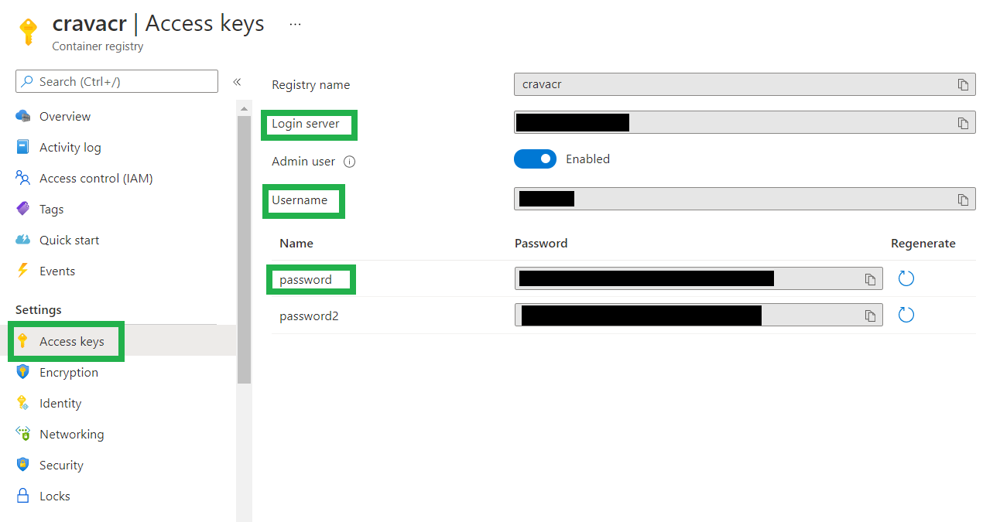
    4.  Set the Azure Container Registry as environment variable 

        ```sh
        export ACR_USRENAME=<ACR Username>
        export ACR_LOGIN_SERVER=<ACR Login Server>
        ```
    3.  Login to the Azure Container Registry 

        Enter the azure container registry password when prompted. 
        ```sh
        [sudo] docker login -u $ACR_USRENAME $ACR_LOGIN_SERVER
        ```
    4. Tag and push the docker image using the below command
        ```sh
        [sudo] docker tag ovms-ext:latest $ACR_LOGIN_SERVER/ovms-ext:latest
        [sudo] docker push $ACR_LOGIN_SERVER/ovms-ext:latest
        ```

3. Setting up IoT Edge Device
    1. Prepare your IoT Edge device

        Follow [this documentation](https://docs.microsoft.com/en-in/azure/azure-video-analyzer/video-analyzer-docs/edge/get-started-detect-motion-emit-events-portal#prepare-your-iot-edge-device) for preparing the IoT Edge device for deployment.
    2. Create and provision an IoT Edge device

        >Note: Skip the section [Install a container engine](https://docs.microsoft.com/en-us/azure/iot-edge/how-to-provision-single-device-linux-symmetric?view=iotedge-2020-11&tabs=azure-portal#install-a-container-engine) on installing conatainer runtime engine.

        For creating an provisioning an Azure IoT Edge device on Linux using symmetrics keys, follow [this documentation](https://docs.microsoft.com/en-us/azure/iot-edge/how-to-provision-single-device-linux-symmetric?view=iotedge-2020-11&tabs=azure-portal).

4. Create an Azure Video Analyzer account
        This cloud service is used to register the Video Analyzer edge module, and for playing back recorded video and video analytics. Follow [this documentation](https://docs.microsoft.com/en-in/azure/azure-video-analyzer/video-analyzer-docs/edge/get-started-detect-motion-emit-events-portal#create-a-video-analyzer-account-in-the-azure-portal) to create an Azure Video Analyzer on your Azure account. 

5. Deploy edge modules
    
    Deploy the IoT edge modules by following the below steps

    1. To deploy the Azure Video Analyzer edge module, refer [this document](https://docs.microsoft.com/en-in/azure/azure-video-analyzer/video-analyzer-docs/edge/get-started-detect-motion-emit-events-portal#deploy-the-video-analyzer-edge-module).
    2. To deploy the RTSP Simulator edge module, refer [this document](https://docs.microsoft.com/en-in/azure/azure-video-analyzer/video-analyzer-docs/edge/get-started-detect-motion-emit-events-portal#deploy-the-edge-module-for-the-rtsp-camera-simulator)
    
        The IoT Edge Runtime Response should be **200 OK** as below.

          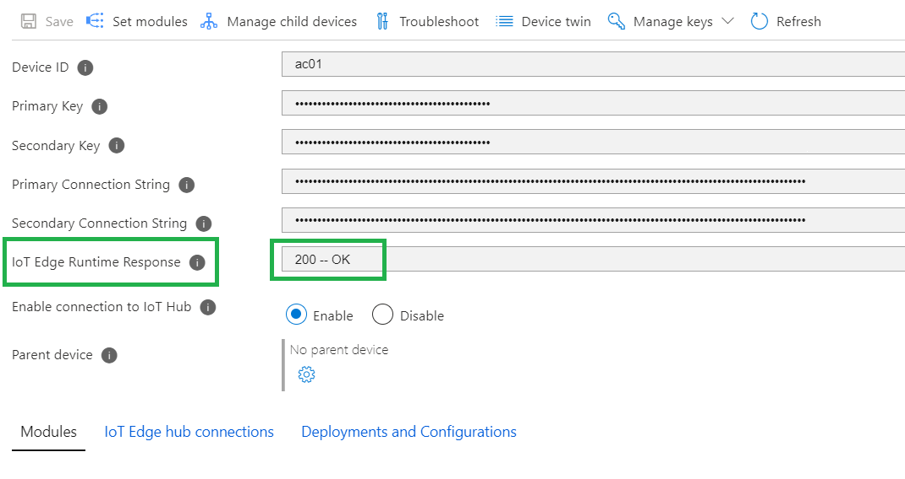

    3. To deploy the OpenVINO™ Model Server - AI Extension follow the below steps.

        1. Open the **Set Modules** under the IoT Edge device that you have created.
        2. Add the **Container Registry Credentials** with the Azure Container Regitry created in step 2 - Push Docker image to Azure Container Registry.

            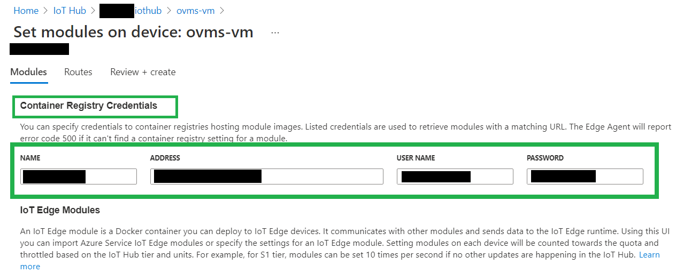

        3. Choose on **Add** and select to add an **IoT Edge Module** as below

            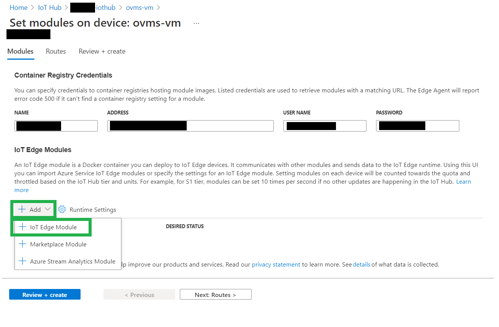

        4. Use the below details to add the OpenVINO Model Server - AI Extension edge module

            * Module Settings

              Update the **Module Settings** as below

              | Property | Value |
              | --- | -----|
              | IoT Edge Module Name | `ovms-ext` |
              | Image URI |  `<ACR Login Server>/ovms-ext:latest` |
              | Restart Policy | always |
              | Desired Status | running | 

            1. Deploying for only CPU based inference

                * Container Create Options

                  Update the **Container Create Options** as below

                  ```json
                  {
                    "ExposedPorts": {
                        "5000/tcp": {}
                    },
                    "HostConfig": {
                        "Binds": [
                            "/tmp:/tmp"
                        ],
                        "PortBindings": {
                            "5000/tcp": [
                                {
                                    "HostPort": "5000"
                                }
                            ]
                        }
                    }
                  }
                  ```

            2. Deployment for GPU based inference

                * Environment Variables

                  Update the **Environment Variable** as below

                  | Name | Type | Value |
                  | --- | --- | ---- |
                  | `OVMS_MODEL_DEVICES` | Text | `vehicle_detection_adas=GPU` |

                
                  Note: This configuration will load the models as follows:
                    | Model | Target Hardware |
                    | --- | --- |
                    | `vehicle_detection_adas` | `GPU` |

                  To know more about target device seletcion for model refer [this section](#target_device).

                * Container Create Options

                  Update the container Create Options as below

                  ```json
                  {
                    "ExposedPorts": {
                        "5000/tcp": {}
                    },
                    "HostConfig": {
                        "Binds": [
                            "/tmp:/tmp"
                        ],
                        "PortBindings": {
                            "5000/tcp": [
                                {
                                    "HostPort": "5000"
                                }
                            ]
                        },
                        "Devices": [
                            {
                                "PathOnHost": "/dev/dri",
                                "PathInContainer": "/dev/dri",
                                "CgroupPermissions": "rwm"
                            }
                        ]
                    }
                  }
                  ```

            3. Deployment for MYRIAD based inference

                Note: This deployment option requires an Intel® Movidius™ Neural Compute Stick visible and accessible on edge machine.

                * Environment Variables

                  Update the **Environment Variable** as below

                  | Name | Type | Value |
                  | --- | --- | ---- |
                  | `OVMS_MODEL_DEVICES` | Text | `vehicle_detection_adas=MYRAID` |

                
                  Note: This configuration will load the models as follows:
                    | Model | Target Hardware |
                    | --- | --- |
                    | `vehicle_detection_adas` | `MYRIAD` |

                  To know more about target device seletcion for model refer [this section](#target_device).

                * Container Create Options

                  Update the **Container Create Options** as below

                  ```json
                  {
                    "User": "0",
                    "ExposedPorts": {
                        "5000/tcp": {}
                    },
                    "HostConfig": {
                        "Binds": [
                            "/tmp:/tmp",
                            "/dev/bus/usb:/dev/bus/usb"
                        ],
                        "PortBindings": {
                            "5000/tcp": [
                                {
                                    "HostPort": "5000"
                                }
                            ]
                        },
                        "DeviceCgroupRules": [
                            "c 189:* rmw"
                        ]
                    }
                  }
                  ```

            4. Deployment for CPU, iGPU and MYRIAD based inference

                > Note: This deployment option requires the following hardware on the edge machine
                >  * Intel® Movidius™ Neural Compute Stick visible and accessible.
                >  * Intel iGPU

                * Environment Variables

                  Update the **Environment Variable** as below

                  | Name | Type | Value |
                  | --- | --- | ---- |
                  | `OVMS_MODEL_DEVICES` | Text | `vehicle_detection_adas=MYRAID;person-vehicle-bike-detection=GPU` |

                
                  Note: This configuration will load the models as follows:
                    | Model | Target Hardware |
                    | --- | --- |
                    | `vehicle_detection_adas` | MYRIAD |
                    | `person-vehicle-bike-detection` | GPU |

                  To know more about target device seletcion for model refer [this section](#target_device).

                * Container Create Options

                  Update the **Container Create Options** as below

                  ```json
                    {
                      "User": "0",
                      "ExposedPorts": {
                          "5000/tcp": {}
                      },
                      "HostConfig": {
                          "Binds": [
                              "/tmp:/tmp",
                              "/dev/bus/usb:/dev/bus/usb"
                          ],
                          "PortBindings": {
                              "5000/tcp": [
                                  {
                                      "HostPort": "5000"
                                  }
                              ]
                          },
                          "Devices": [
                              {
                                  "PathOnHost": "/dev/dri",
                                  "PathInContainer": "/dev/dri",
                                  "CgroupPermissions": "rwm"
                              }
                          ],
                          "DeviceCgroupRules": [
                              "c 189:* rmw"
                          ]
                      }
                    }
                  ```

        5. Once Completed, click and **Add** and then **Review and Create** to deploy the module.

    4. Update Azure Video Analyzer edge module
    
        The Azure Video Analyzer edge module configuration need to be updated to allow direct method calls from Azure IoT Hub. 

        Follow the below steps to update the module configuration.

        1. Open the **Set Modules** under the IoT Edge device that you have updated above.
        2. Select the module with name **avaedge** and select **Module Twin Settings**.
        3. Update the `allowUnsecuredEndpoints` parameter from `false` to `true` as shown below.

            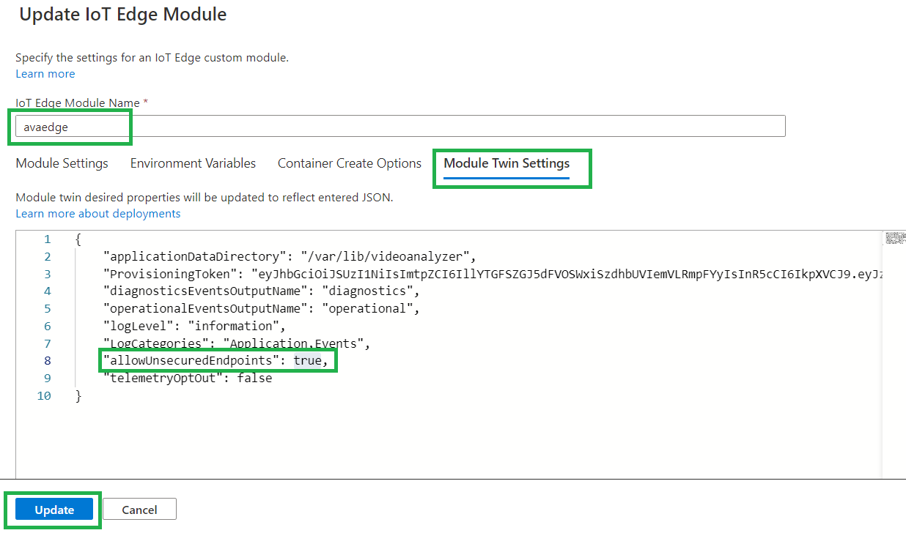

        4. Once updated click on **Update** and then **Review and Create** to deploy the updated module.

**[[Back to Table of Contents ↑]](#top)**


<a id="run_inference"> </a>
## Running Inference on OpenVINO™ Model Server - AI Extension

1. Running inference on Linux machine deployment.

    Refer [this section](#rest_api) to know more about running inference using a REST API client directly on an Linux machine.

2. Analyzing Live Video using Azure Video Analyzer 

    1. Setup [Visual Studio Code](https://code.visualstudio.com/) with  [Azure IoT Tools extension](https://marketplace.visualstudio.com/items?itemName=vsciot-vscode.azure-iot-tools).

    2. Set up your Visual Studio Code with connection to Azure Iot Hub by following [this documentation](https://docs.microsoft.com/en-in/azure/azure-video-analyzer/video-analyzer-docs/edge/get-started-detect-motion-emit-events-portal#set-up-your-development-environment).

      <a id="monitor_events"> </a>

      3. Prepare to monitor the modules

          Once start the inference pipelines, the events will be sent to the IoT Hub. To see these events, follow these steps:

          *  Open the Explorer pane in Visual Studio Code, and look for **Azure IoT Hub** in the lower-left corner.

          * Expand the Devices node.

          * Right-click on iot device name that you have created, and select **Start Monitoring Built-in Event Endpoint**.

              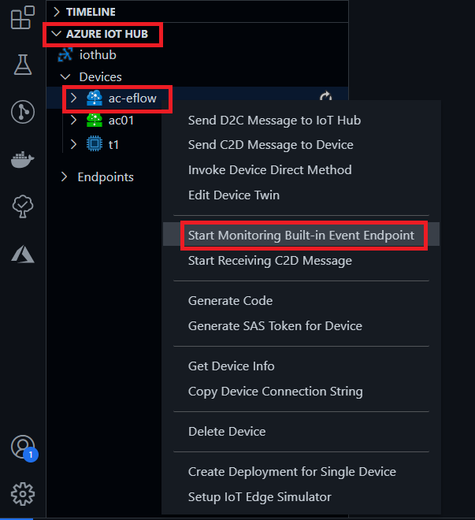
          
          * The Visual Studio Code will start monitoring to the event of the selected IoT Hub on the **OUTPUT** window.

              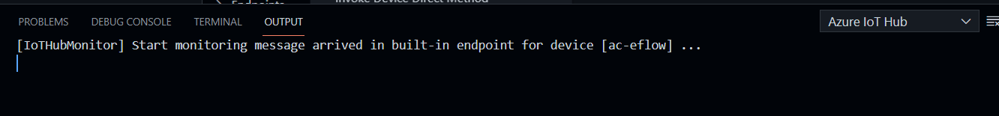

    4. Setting the Pipeline Topology on the Azure Video Analyzer

        * From the IoT Edge, click on the `avaedge` module

            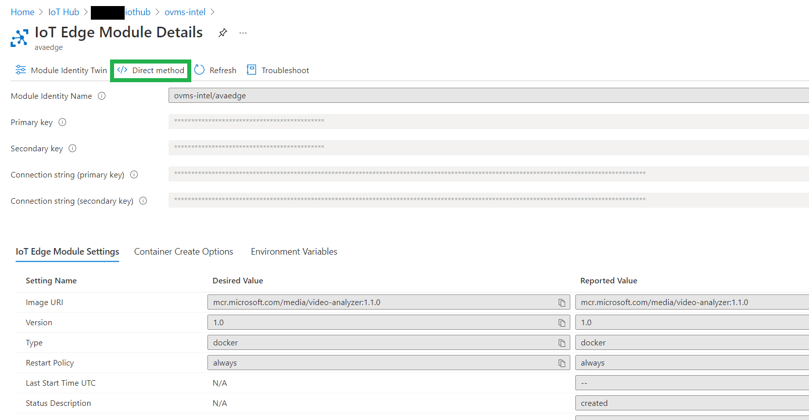

    5. Create a pipeline topology using the below content

        * Method Name
          
            pipelineTopologySet
        * Payload:
      
          ```json
          {
            "@apiVersion": "1.1",
            "name": "InferencingWithOpenVINO",
            "properties": {
              "description": "Analyzing live video using HTTP Extension to send images to the OpenVINO Model Server – AI Extension module, from Intel",
              "parameters": [
                {
                  "name": "rtspUserName",
                  "type": "String",
                  "description": "rtsp source user name.",
                  "default": "dummyUserName"
                },
                {
                  "name": "rtspPassword",
                  "type": "String",
                  "description": "rtsp source password.",
                  "default": "dummyPassword"
                },
                {
                  "name": "rtspUrl",
                  "type": "String",
                  "description": "rtsp Url"
                },
                {
                  "name": "inferencingUrl",
                  "type": "String",
                  "description": "inferencing Url",
                  "default": "http://ovms-ext:5000/vehicleDetection"
                },
                {
                  "name": "inferencingUserName",
                  "type": "String",
                  "description": "inferencing endpoint user name.",
                  "default": "dummyUserName"
                },
                {
                  "name": "inferencingPassword",
                  "type": "String",
                  "description": "inferencing endpoint password.",
                  "default": "dummyPassword"
                }
              ],
              "sources": [
                {
                  "@type": "#Microsoft.VideoAnalyzer.RtspSource",
                  "name": "rtspSource",
                  "transport": "tcp",
                  "endpoint": {
                    "@type": "#Microsoft.VideoAnalyzer.UnsecuredEndpoint",
                    "url": "${rtspUrl}",
                    "credentials": {
                      "@type": "#Microsoft.VideoAnalyzer.UsernamePasswordCredentials",
                      "username": "${rtspUserName}",
                      "password": "${rtspPassword}"
                    }
                  }
                }
              ],
              "processors": [
                {
                  "@type": "#Microsoft.VideoAnalyzer.HttpExtension",
                  "name": "httpExtension",
                  "endpoint": {
                    "@type": "#Microsoft.VideoAnalyzer.UnsecuredEndpoint",
                    "url": "${inferencingUrl}",
                    "credentials": {
                      "@type": "#Microsoft.VideoAnalyzer.UsernamePasswordCredentials",
                      "username": "${inferencingUserName}",
                      "password": "${inferencingPassword}"
                    }
                  },
                  "image": {
                    "format": {
                      "@type": "#Microsoft.VideoAnalyzer.ImageFormatBmp"
                    }
                  },
                  "samplingOptions": {
                    "skipSamplesWithoutAnnotation": "false",
                    "maximumSamplesPerSecond": "5"
                  },
                  "inputs": [
                    {
                      "nodeName": "rtspSource"
                    }
                  ]
                }
              ],
              "sinks": [
                {
                  "@type": "#Microsoft.VideoAnalyzer.IotHubMessageSink",
                  "name": "hubSink",
                  "hubOutputName": "inferenceOutput",
                  "inputs": [
                    {
                      "nodeName": "httpExtension"
                    }
                  ]
                }
              ]
            }
          }
          ```
    6. Click on the **Invoke Method** to set the pipeline topology

          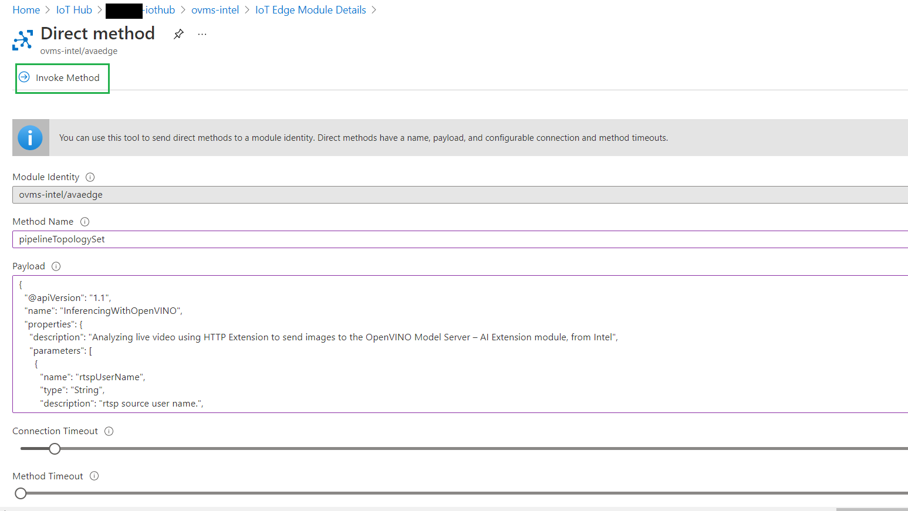
      
    7. The **Result** should show status as `201`.

          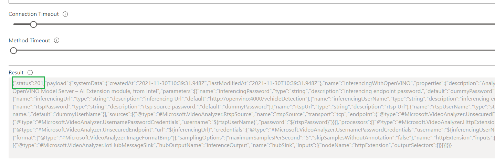

    7. Set live pipeline to detect vehicles.

          * Method Name

              `livePipelineSet`
          * Payload

            ```json
            {
              "@apiVersion": "1.1",
              "name": "Sample-Pipeline-1",
              "properties": {
                "topologyName": "InferencingWithOpenVINO",
                "description": "Sample pipeline description",
                "parameters": [
                  {
                    "name": "rtspUrl",
                    "value": "rtsp://rtspsim:554/media/camera-300s.mkv"
                  },
                  {
                    "name": "rtspUserName",
                    "value": "testuser"
                  },
                  {
                    "name": "rtspPassword",
                    "value": "testpassword"
                  }
                ]
              }
            }
            ```
      9. Activate the live pipeline to start the inference

          * Method Name 

                livePipelineActivate

          * Payload
              
              ```json
              {
                "@apiVersion": "1.1",
                "name": "Sample-Pipeline-1"
              }

      10. The result of the detection can viewed on the **OUPUT** window on Visual studio code that was created on step [Prepare to monitor the modules](#monitor_events).

          Here is an example of the inference result.

          ```json
          {
            "timestamp": 145819820073974,
            "inferences": [
              {
                "type": "entity",
                "subtype": "vehicleDetection",
                "entity": {
                  "tag": {
                    "value": "vehicle",
                    "confidence": 0.9147264
                  },
                  "box": {
                    "l": 0.6853116,
                    "t": 0.5035262,
                    "w": 0.04322505,
                    "h": 0.03426218
              }
            }
          }
            ````
  
    > To know more about Azure Video Analyzer Pipelines refer [this documentation](https://docs.microsoft.com/en-us/azure/azure-video-analyzer/video-analyzer-docs/pipeline)

**[[Back to Table of Contents ↑]](#top)**


<a id="configuration"></a>
## Configuration of OpenVINO™ Model Server - AI Extension

OpenVINO™ Model Server - AI Extension includes two components which require proper configuration.
* OpenVINO™ Model Server - serves all models and executes inference operation
* AI Extension REST API wrapper - translates AVA API, run pre and post processing operations, communicates with OVMS via localhost and gRPC interface.

OpenVINO™ Model Server requires file `/opt/ams_models/ovms_config.json` which is by default configured
to use [4 exemplary models](https://github.com/openvinotoolkit/model_server/blob/lva-ovms-cpp/extras/ams_models/ovms_config.json).

AI Extension REST API wrapper requires model configuration files describing all enabled models.
Models config files should be present in `/opt/ams_models/` folder. Model configuration files should have _model.json suffix.
They include the mapping between ovms models from `ovms_config.json` and AI Extension REST API endpoint name.

Model files in OpenVINO™ Intermediate Representation format should be stored in the folders structure
like defined on [OVMS documentation](https://github.com/openvinotoolkit/model_server/blob/main/docs/models_repository.md).

Note: OVMS - AI Extension was tested for the models included in the docker image. 
It should be possible to swap the models if they have correspondent format and content of the inputs and outputs. 
It is, however, not officially supported. 

**[[Back to Table of Contents ↑]](#top)**


<a id="parameters"></a>
## OpenVINO™ Model Server - AI Extension parameters

OpenVINO™ Model Server - AI Extension is started by default with a command `/ams_wrapper/start_ams.py`. It accepts the following parameters:

| Parameter | ENV variable Name | Description | 
| ----- | --- | --- |
| `--ams_port` | `AMS_PORT` |  Port for AMS Service to listen on (default: 5000) |
| `--ovms_port` | `OVMS_PORT` | Port for OVMS to listen on (default: 9000) |
| `--workers` | `WORKERS` |  AMS service workers (default: 20) |
| `--ovms_model_devices` | `OVMS_MODEL_DEVICES` | Colon delimited list of model devices, in following format: <br> `'<model_1_name>=<device_name>;<model_2_name>=<device_name>'` |

**[[Back to Table of Contents ↑]](#top)**


<a id="rest_api"></a>
## REST API

The HTTP contract is defined as follows:
* OpenVINO™ Model Server - AI Extension acts as the HTTP server 
* AVA acts as the HTTP client


| POST        | `http://hostname:port/<endpoint_name>` |
| ------------- |-------------|
| Accept      | application/json, */* |
| Authorization     | None |
| Content-Type | image/jpeg <br> image/png <br>  image/bmp |
| User-Agent| Azure Media Services|
| Body | Image bytes, binary encoded in one of the supported content types |

The `endpoint_name` defines the model you want to apply to the image. The allowed values are:
*  `vehicleDetection`
* `vehicleClassification`
* `personVehicleBikeDetection`
* `faceDetection`

See below for more details about these models.

Example:

```
POST http://localhost:5000/vehicleDetection HTTP/1.1
Host: localhost:5000
x-ms-client-request-id: d6050cd4-c9f2-42d3-9adc-53ba7e440f17
Content-Type: image/bmp
Content-Length: 519222

(Image Binary Content)
```

Example CURL request for the above REST API request:

```sh
curl -X POST -H "Content-Type: image/jpg" --data-binary @test_image.jpg localhost:5000/vehicleDetection | jq
```

*Note:* Depending on the model configuration, input image resolution needs to match the model's expected size or
it will be resized automatically. 

Response:

|Response| Description |
| ------------- |-------------|
| Status code | 200 OK - Inference results found <br>204 No Content - No content found by the AI <br> 400 Bad Request - Not expected <br> 500 Internal Server Error - Not expected <br> 503 Server Busy - AMS will back-off based on “Retry-After” header or based on a default amount of time in case header not preset.|
| Content-Type     | application/json |
| Content-Length | Body length, in bytes |
| Body | JSON object with single “inferences” property. |

**[[Back to Table of Contents ↑]](#top)**


<a id="supported_models"></a>
## Supported models categories

Models configured in OpenVINO™ Model Server - AI Extension need to belong to one of defined categories. 
The category defines what kind of data is in the model response and in what format. 
See the category characteristics below to learn more about their requirements. 
Each model needs to have an associated config file, which describes the included classes,
attributes and labels. The config can also specify input data – like resolution or pre-processing parameters. 

**[[Back to Table of Contents ↑]](#top)**

### Object detection

In this category, models should return response in the shape `[1, 1, N, 7]` where N is the number of detected bounding boxes.
For each detection, the description has the 
format: [image_id, label, conf, x_min, y_min, x_max, y_max], where:
- image_id - ID of the image in the batch
- label - predicted class ID
- conf - confidence for the predicted class
- (x_min, y_min) - coordinates of the top left bounding box corner
- (x_max, y_max) - coordinates of the bottom right bounding box corner.

There are several Object Detection models available in the [OpenVINO™ Toolkit – Open Model Zoo](https://docs.openvino.ai/2021.4/omz_models_group_intel.html). 
The Inference Server Docker image comes pre-built with the following Object Detection models:

* vehicle-detection - [vehicle-detection-adas-0002](https://github.com/openvinotoolkit/open_model_zoo/tree/master/models/intel/vehicle-detection-adas-0002)
* face-detection - [face-detection-adas-0001](https://github.com/openvinotoolkit/open_model_zoo/tree/master/models/intel/face-detection-adas-0001)
* person-vehicle-bike-detection-crossroad - [person-vehicle-bike-detection-crossroad-0078](https://github.com/openvinotoolkit/open_model_zoo/tree/master/models/intel/person-vehicle-bike-detection-crossroad-0078)

Each model should also include a configuration file in json format. Example of such
configuration file is [here](https://github.com/openvinotoolkit/model_server/blob/lva-ovms-cpp/extras/ams_models/vehicle_detection_adas_model.json).

Below is a sample of the model output:
```json
{
    "inferences": [
      {
        "type": "entity",
        "subtype": "vehicleDetection",
        "entity": {
          "tag": {
            "value": "vehicle",
            "confidence": 0.15077224373817444
          },
          "box": {
            "l": 0,
            "t": 0.25023195147514343,
            "w": 0.853949785232544,
            "h": 0.7095241844654083
          }
        }
      }
    ]
 }
```

### Classification models

Classification models, in this category, give the results in softmax layer. This includes a set
of probabilities in classes defined for the model.
Each output of the model should have the shape `[1, C , ...]`. First dimension represents the batch size,
which should be set to 1. `C` represents all classes defined in the model. Remaining dimensions 
are ignored (if present, first index is used).

Examples of such models are available in the [OpenVINO™ Toolkit – Open Model Zoo](https://docs.openvino.ai/2021.4/omz_models_group_intel.html).
The following classification model is included in the OVMS - AI Extension docker image: 
* vehicle-attributes-recognition - [vehicle-attributes-recognition-barrier-0039](https://github.com/openvinotoolkit/open_model_zoo/tree/master/models/intel/vehicle-attributes-recognition-barrier-0039)

Model includes a configuration file in json format. See an example configuration file [here](https://github.com/openvinotoolkit/model_server/blob/lva-ovms-cpp/extras/ams_models/vehicle_attributes_model.json)

Below is a sample of such model:
```json
{
    "inferences": [
      {
        "type": "classification",
        "subtype": "color",
        "classification": {
          "tag": {
            "value": "gray",
            "confidence": 0.6284224987030029
          }
        }
      },
      {
        "type": "classification",
        "subtype": "type",
        "classification": {
          "tag": {
            "value": "truck",
            "confidence": 0.9994522929191589
          }
        }
      }
    ]
  }
```

**[[Back to Table of Contents ↑]](#top)**


<a id="target_device"></a>
## Target device selection for models

By default, the OpenVINO™ Model Server - AI Extension is started, serving included models, using CPU as the target device executing the inference requests. 
Besides CPU, OVMS - AI Extension is currently supporting 
[Myriad Plugin](https://docs.openvino.ai/latest/openvino_docs_IE_DG_supported_plugins_MYRIAD.html), 
[GPU Plugin](https://docs.openvino.ai/latest/openvino_docs_IE_DG_supported_plugins_GPU.html)
and [Heterogeneous Plugin](https://docs.openvino.ai/latest/openvino_docs_IE_DG_supported_plugins_HETERO.html). 

It is possible to set the target device for each individual model by setting additional environment variable 
OVMS_MODEL_DEVICES, or passing -–ovms_model_devices parameter to OVMS - AI Extension, with a semicolon separated list of models with assigned target devices. 
Below is an example: 
OVMS_MODEL_DEVICES='vehicle_detection_adas=CPU;vehicle_attributes=MYRIAD' 

Note: Depending on the device, additional docker parameters might be required to mount required resources in the container.
There should be also installed appropriate drivers on the host operating system.
Refer to the plugin documentation and examples from [OVMS documentation](https://github.com/openvinotoolkit/model_server/blob/main/docs/docker_container.md#running-openvino-model-server-with-ai-accelerators-ncs-hddl-and-gpu-).

**[[Back to Table of Contents ↑]](#top)**


<a id="preformance_tuning"></a>
## Performance tuning
OVMS component is configured for most generic manner to work well in low and high spec resources. 
In case there is a need to adjust the performance parameters, it can be done by replacing ovms_config.json 
file in a custom docker image or mounting it from a local storage. In that case follow the recommendation 
for [OVMS](https://github.com/openvinotoolkit/model_server/blob/main/docs/performance_tuning.md) and [OpenVINO plugins](https://docs.openvino.ai/latest/openvino_docs_IE_DG_supported_plugins_Supported_Devices.html).  

**[[Back to Table of Contents ↑]](#top)**


<a id="model_config"></a>
## Models configuration

Model configuration json file has the following fields:

```
endpoint: name for the endpoint under which model will be exposed [REQUIRED]
model_type: type of the model, currently supported types are: detection, classification_attributes
 [REQUIRED]
inputs: list of model's input configurations, refer to input configuration schema below [REQUIRED]
outputs: list of model's outputs configurations, refer to output configuration schema below [REQUIRED]
```

Model's input configuration schema:

```
input_name: name of the input [REQUIRED]
channels: number of channels in input image, default: 3 [OPTIONAL]
target_height: image's height expected by model, images with different height will be resized to match target height [OPTIONAL]
target_width: image's width expected by model, images with different width will be resized to match target width [OPTIONAL]
color_format: color format expected by model, supported formats: RGB, BGR, default: BGR [OPTIONAL]
scale: scaling factor for image pixel values, each pixel value will be multiplied by this value if specified [OPTIONAL]
standardization: If set to true, images will be linearly scaled to have mean 0 and variance 1, valid values: true/false, default: false [OPTIONAL]
input_format: image input format, supported formats: NHWC, NCHW, default: NCHW [OPTIONAL]
```
Model's output configuration schema:
```
output_name: name of the output [REQUIRED]
value_index_mapping: dictionary containing description of fields in model's inference output [OPTIONAL]
classes: dictionary containing mapping of classes to values returned by the model [OPTIONAL]
confidence_threshold: if set, only inference results with confidence higher or equal to confidence_threshold will be returned [OPTIONAL]
top_k_results: if set, only top k predicitons, sorted by confidence, will be returned (where k is the value of this parameter) [OPTIONAL]
is_softmax: defines if this output should be considered as Softmax, valid values: true/false, default: true [OPTIONAL]
value_multiplier:must be set if is_softmax is set to False, inference results for this specific output will be multiplied by this value [OPTIONAL]
for example if age value is returned in the inference output (0.2456777) we need to multiply it by 100 to get the human readable age format. 
is_softmax should be then set to False and value_multiplier must be set to 100.
```

Model configuration example:

```json
{
    "endpoint": "vehicleDetection",
    "model_type": "detection",
    "inputs": [
        {
          "input_name": "data",
          "input_format": "NCHW",
          "color_format": "BGR",
          "target_height": 384,
          "target_width": 672,
          "channels": 3,
          "standardization": false
        }
      ],
    "outputs": [
        {
            "output_name": "detection_out",
            "classes": {
                "background": 0.0,
                "vehicle": 1.0
            },
            "value_index_mapping": {
                "image_id": 0,
                "value": 1,
                "confidence": 2,
                "x_min": 3,
                "y_min": 4,
                "x_max": 5,
                "y_max": 6
            }
        }
    ],
    "ovms_mapping": {
        "model_name": "vehicle_detection_adas",
        "model_version": 0
    }
}
```

**[[Back to Table of Contents ↑]](#top)**


<a id="running_tests"></a>
## Running Tests

### Running Functional Tests
Follow the below steps to run functional test cases for the OpenVINO Model Server AI Extension

1. [Building the OpenVINO™ Model Server - AI Extension Docker Image](#build)

    >Note: If already have built docker image from [Building the OpenVINO™ Model Server - AI Extension Docker Image](#build) step, skip this step.

2. Setup the testing environment

    1. Run the below command to install python `virtualenv` package
        ```sh
        pip3 install virtualenv
        ```
    2. Create the virtual environment `.venv`
        ```sh
        cd <path to repo>/

        python3 -m virtualenv -p python3 .venv
        ```
    3. Activate the virtual environment `.venv` 
        ```sh
        . .venv/bin/activate
        ```
    2. Install the required python3 packages
        ```sh
        pip3 install -r src/tests/requirements.txt

        pip3 install -r src/ams_wrapper/requirements.txt
        ```

3. Add the non-root user to docker group

    To add the non-root user to the docker group follow [Manage Docker as a non-root user](https://docs.docker.com/engine/install/linux-postinstall/#manage-docker-as-a-non-root-user) documentation.

4. Run functional tests

    Run the below command to run the functional tests

      ```sh
      cd <path to repo>/src/tests/

      pytest functional/test_single_model_vehicle_attributes.py functional/test_ams_inference.py --image <ovms-ext docker image name>
      ```

### Running unit tests
Unit tests for the extension can be ran inside the container while the ovms-ext is running.

Follow the below steps to run the unit tests
1. [Building the OpenVINO™ Model Server - AI Extension Docker Image](#build)

    >Note: If already have built docker image from [Building the OpenVINO™ Model Server - AI Extension Docker Image](#build) step, skip this step.
2. Start the docker container using the below command

      ```sh
     sudo docker run -d --name ovms-ext-test <ovms-ext image name>
    ```

3. exec into the running container using the below command

    ```sh
    sudo docker exec -u 0 -it ovms-ext-test /bin/bash
    ```

4. On the container shell run the following commands to start the unit test

    ```sh
    cd tests

    make ams_test
    ```

5. The above command will run all unit tests defined and you should see all 224 unit test as passed.

**[Go to Top ↑](#top)**