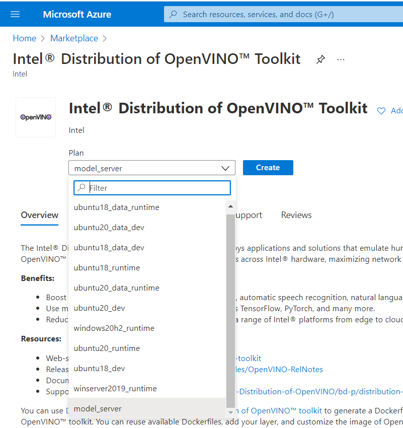
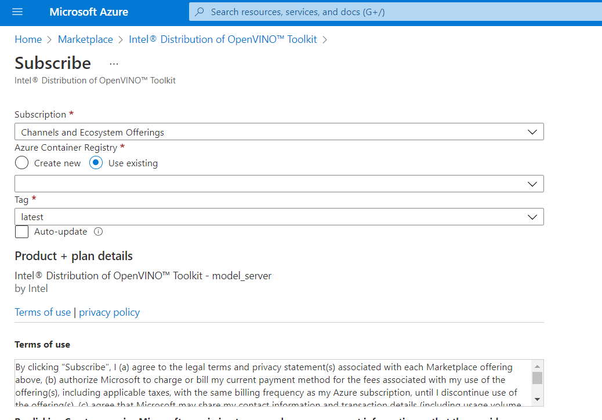

# Build OVMS extension with OVMS base image from Azure marketplace

### 1. Prerequisites
* An Azure account with an active subscription

    >Note: An Azure subscription with both **Contributor** role and **User Access Administrator** roles is required.

### 2. Create Azure Container Registry

To create an Azure Container Registry (ACR), use the following link: [Creating a container registry](https://docs.microsoft.com/en-in/azure/container-registry/container-registry-get-started-portal). 


### 3. Host OVMS container image from marketplace in Azure Container Registry

1. Go to marketplace in Azure portal and search for "Intel® Distribution of OpenVINO™ Toolkit"
2. Select "model_server" from the drop down and click on create button.
     
3. Select the container registry created in the previous step as shown in the below image and click on subscribe button.
     
     
### 4. Pull OVMS docker image to development machine

1. Go to `Azure portal > container registry > choose your container registry where ovms image is hosted > Access keys` and get the details of container registry and make a note of username, password, and login server.

     
     
2. Clone the repository to development machine

3. Set the Azure Container Registry as environment variable 

    ```sh
        export ACR_USRENAME=<ACR Username>
        export ACR_LOGIN_SERVER=<ACR Login Server>
    ```

4. Login to the Azure Container Registry 

    Enter the azure container registry password when prompted. 
    ```sh
        [sudo] docker login -u $ACR_USRENAME $ACR_LOGIN_SERVER
    ```

5. Pull the OVMS docker image using the below command

    ```sh
        [sudo] docker pull $ACR_LOGIN_SERVER/intel_corporation/model_server:latest
    ```
    
6. Tag docker image with generic name

    ```sh
    [sudo] docker tag $ACR_LOGIN_SERVER/intel_corporation/model_server:latest intel_corporation/model_server:latest
    ```

### 5. Update Dockerfile and build container image

1. Open Dockerfile from home directory of this repo and update line 3 as below 

    ```
    FROM intel_corporation/model_server:latest
    ```
2. Build the docker image, using the following command

    ```sh
    sudo docker build -t ovms-ext:latest .
    ```
### 6. Deploy OVMS extension container

Execute steps from [Deploying the OpenVINO™ Model Server - AI Extension](./README.md/#3-deploying-the-openvino%E2%84%A2-model-server---ai-extension)


